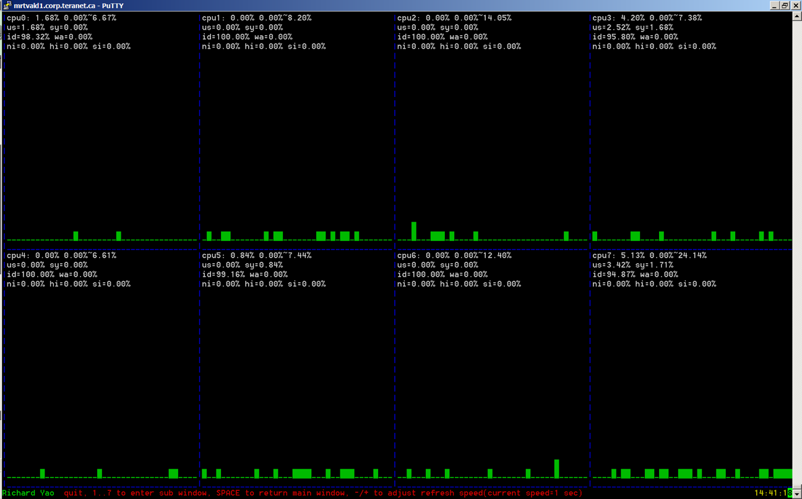

# libsysmon

### libsysmon is a console based monitor tool. It does similar work like top, but with a more intuitive intreface.

### libsysmon was developed at 2006 when I learnt Ruby. It was the first program I wrote in Ruby.

### libsysmon requires shared library of ncurses.

## Screenshots

